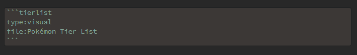

# Tierlist for Obsidian

## Disclaimer
Attention this plugin is still under development and may cause unexpected errors. Install at your own risk.  

## About the plugin
With this plugin you can create tier lists and integrate them into Obsidian.

With the help of the code blocks, you can insert the lists into your notes. There are two ways to add them.  
### Visual 

### Table

## Installation 
1. Clone or load this repository.
2. Install the dependencies using npm install or yarn install.
3. Build the plugin with the help of npm build or yarn build.
4. Copy the files main.js, manifest.json and styles.css to (path/to/your/Vault)/.obsidian/plugins/TierListForObsidian (create the folder if not existing).